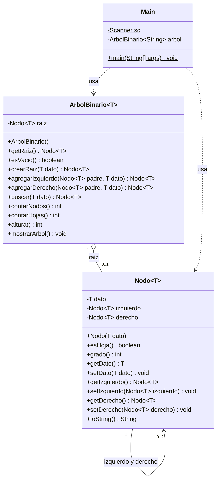
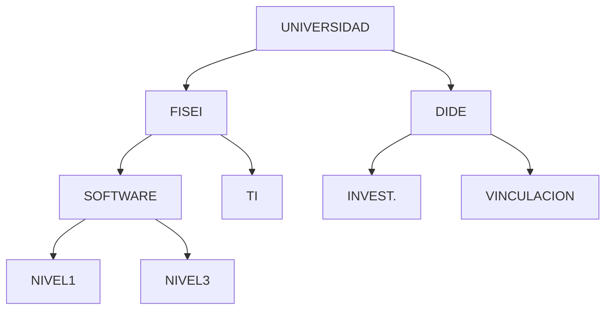

# Diagrama de clases

```mermaid
classDiagram
    class Nodo~T~ {
        -T dato
        -Nodo~T~ izquierdo
        -Nodo~T~ derecho
        +Nodo(T dato)
        +esHoja() boolean
        +grado() int
        +getDato() T
        +setDato(T dato) void
        +getIzquierdo() Nodo~T~
        +setIzquierdo(Nodo~T~ izquierdo) void
        +getDerecho() Nodo~T~
        +setDerecho(Nodo~T~ derecho) void
        +toString() String
    }

    class ArbolBinario~T~ {
        -Nodo~T~ raiz
        +ArbolBinario()
        +getRaiz() Nodo~T~
        +esVacio() boolean
        +crearRaiz(T dato) Nodo~T~
        +agregarIzquierdo(Nodo~T~ padre, T dato) Nodo~T~
        +agregarDerecho(Nodo~T~ padre, T dato) Nodo~T~
        +buscar(T dato) Nodo~T~
        +contarNodos() int
        +contarHojas() int
        +altura() int
        +mostrarArbol() void
    }

    class Main {
        -Scanner sc$
        -ArbolBinario~String~ arbol$
        +main(String[] args)$ void
    }

    ArbolBinario~T~ "1" o-- "0..1" Nodo~T~ : raiz
    Nodo~T~ "1" --> "0..2" Nodo~T~ : izquierdo y derecho
    Main ..> ArbolBinario~T~ : usa
    Main ..> Nodo~T~ : usa
```

# Arbol inicial

```mermaid
flowchart TD
    U[UNIVERSIDAD] --> F[FISEI]
    U --> D[DIDE]
    F --> S[SOFTWARE]
    F --> T[TI]
    D --> I["INVEST."]
    D --> V[VINCULACION]
    S --> N1[NIVEL1]
    S --> N3[NIVEL3]
```
